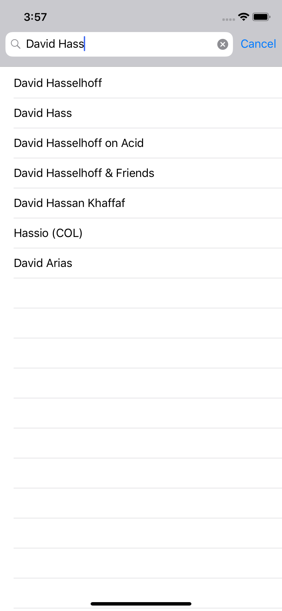
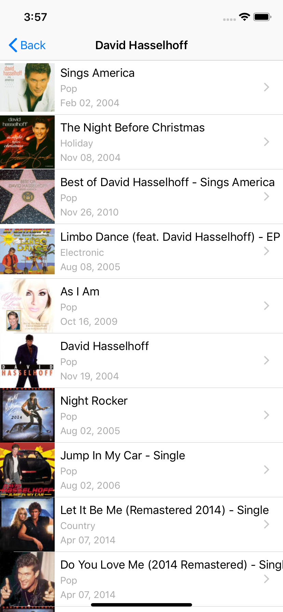

# iTunesClient

  
  

## Overview

iTunesClient is an iOS app that allows users to search for artists using the iTunes Search API. The app incorporates:

- Swift
- JSON
- Modeling complex endpoints
- Downloading images using operation queues
- MVVM

## Getting Started

> This app is not available on the App Store.

### Prerequisites

- A Mac running Xcode

### Installation

1. Clone or download the project to your local machine
2. Open the project in Xcode
3. Run the simulator

## Acknowledgements

The following resources were used in the development of this project. All custom code is my own.

- [Build an iTunes Search App](https://teamtreehouse.com/library/build-an-itunes-search-app)

Interested in learning more about iOS Development? [Sign up today](http://referrals.trhou.se/bobbyconti1)!
